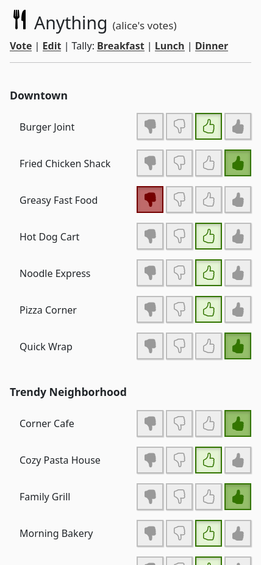
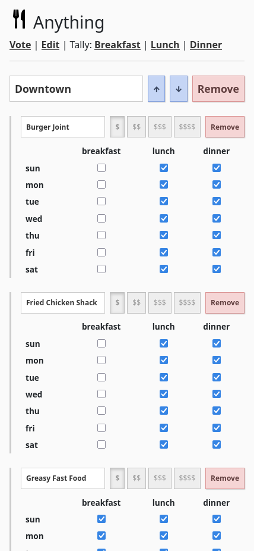
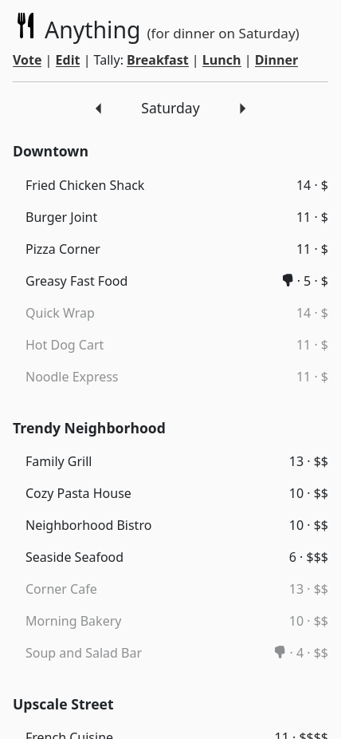

# alnvdl/anything
Anything is a simple web application built for when you ask your significant
other what's for dinner and the answer you get is "anything". It is mostly
built and maintained using LLMs (see [How this was built](#how-this-was-built)).

It lists places (or maybe even dishes if you are cooking at home), and lets
people vote on their favorites (with strong-no, no, yes and strong-yes votes).
An aggregate score is calculated using a formula, and users can see places
sorted by score and cost. You can also use groups to organize places.

<table>
    <tr>
    <td></td>
    <td></td>
    <td></td>
    </tr>
</table>

## Running
To run Anything locally, just install Go 1.25+ and run `make dev`.

Then access the application at http://localhost:8080/?token=alice.

Given the low-stakes of the data involved, we chose to keep the authentication
token in the URL for simplicity. People are supposed to bookmark their secret
URL to use the application. Support for a PWA mode may or may not be added in
the future.

## Environment variables
The following environment variables can be used to configure the application:

- `DB_PATH`: The path to the database file. Default is `db.json`.
- `ENTRIES`: A JSON object defining entries grouped by category, where each
   entry has a `cost` and an `open` schedule mapping weekdays to periods.
   This is only used for an initial import if the database has no entries;
   entries are persisted in the database afterwards.
- `HEALTH_CHECK_INTERVAL`: The interval for checking the health of the
   service. Default is `3m`.
- `PEOPLE`: A JSON object mapping person names to their tokens
   (e.g., `{"alice":"alice","bob":"bob"}`). To generate good tokens, you can
   run `openssl rand 15 | basenc --base64url`. This variable is required.
- `PERIODS`: A JSON object mapping period names to `[startHour, endHour]`
   pairs (e.g., `{"breakfast":[0,10],"lunch":[10,15],"dinner":[15,0]}`).
   Hours must not overlap across periods. Wrapping around midnight is
   supported. This variable is required.
- `PERSIST_INTERVAL`: The interval for persisting state to the disk.
   Default is `5m`.
- `PORT`: The port on which the server will run. Default is `8080`.
- `TIMEZONE`: The IANA timezone string used for determining the current period
   (e.g., `America/Sao_Paulo`). This variable is required.

## Deploying in Azure App Service
It is quite easy to deploy and run this application on the Azure App Service
free tier.

1. Deploy the app in Azure following the
   [quick start guide](https://learn.microsoft.com/en-us/azure/app-service/quickstart-custom-container?tabs=dotnet&pivots=container-linux-azure-portal).
   When selecting the container image, input `ghcr.io` as the registry and
   `alnvdl/anything:main` as the image, leaving the startup command blank.

2. Make sure to set the following environment variables in the deployment:
   | Environment variable                  | Value
   | -                                     | -
   | `DB_PATH`                             | `/home/db.json`
   | `ENTRIES`                             | JSON object with grouped entries (see `Makefile` for an example)
   | `PEOPLE`                              | JSON object mapping names to tokens (see `Makefile` for an example)
   | `PERIODS`                             | JSON object with period definitions (see `Makefile` for an example)
   | `PORT`                                | `80`
   | `TIMEZONE`                            | IANA timezone (e.g., `America/Sao_Paulo`)
   | `WEBSITES_ENABLE_APP_SERVICE_STORAGE` | `true`

3. While not required, you may want to enable log persistence as well by
   following this
   [guide](https://learn.microsoft.com/en-us/azure/app-service/troubleshoot-diagnostic-logs#enable-application-logging-linuxcontainer).

4. You may need to restart the application after the initial setup to make
   sure all settings are picked up.

5. To deploy new versions of the image, just restart the application (assuming
   the deployment is using the `main` tag mentioned in step 1).

## How this was built
This app was built with Claude Opus 4.6 in GitHub Copilot in one shot using:
- [this prompt](https://gist.github.com/alnvdl/5d0d175c5a40b442048f879dc0ce4cef)
- along with a [sample `index.html`](https://gist.github.com/alnvdl/c443cdf50799a3f7a8a8b897bdfbb7db)
  that I partially built myself beforehand to imagine the UI, with Claude Haiku
  4.5.
- and CSS files from my
  [`lightwebapp` stylesheet](https://github.com/alnvdl/lightwebapp/tree/fed649d9ba4902d5f83bbddf9256a06d9e93fff8).

The application worked on the first shot and I was very satisfied with the
result. Then I reviewed and adapted the code myself in a few places and applied
a bunch more prompts over several days to refine the code and add new features.

The result is what you can see in this repo. This is not 100% what I would have
coded myself, but I wanted to exercise how I will maintain and evolve a rather
small application almost entirely coded with an LLM.

This application intentionally avoids using external dependencies to make it
easier to maintain many years from now.

## Icons
All icons are from the
[Bootstrap Icons project](https://icons.getbootstrap.com/).
